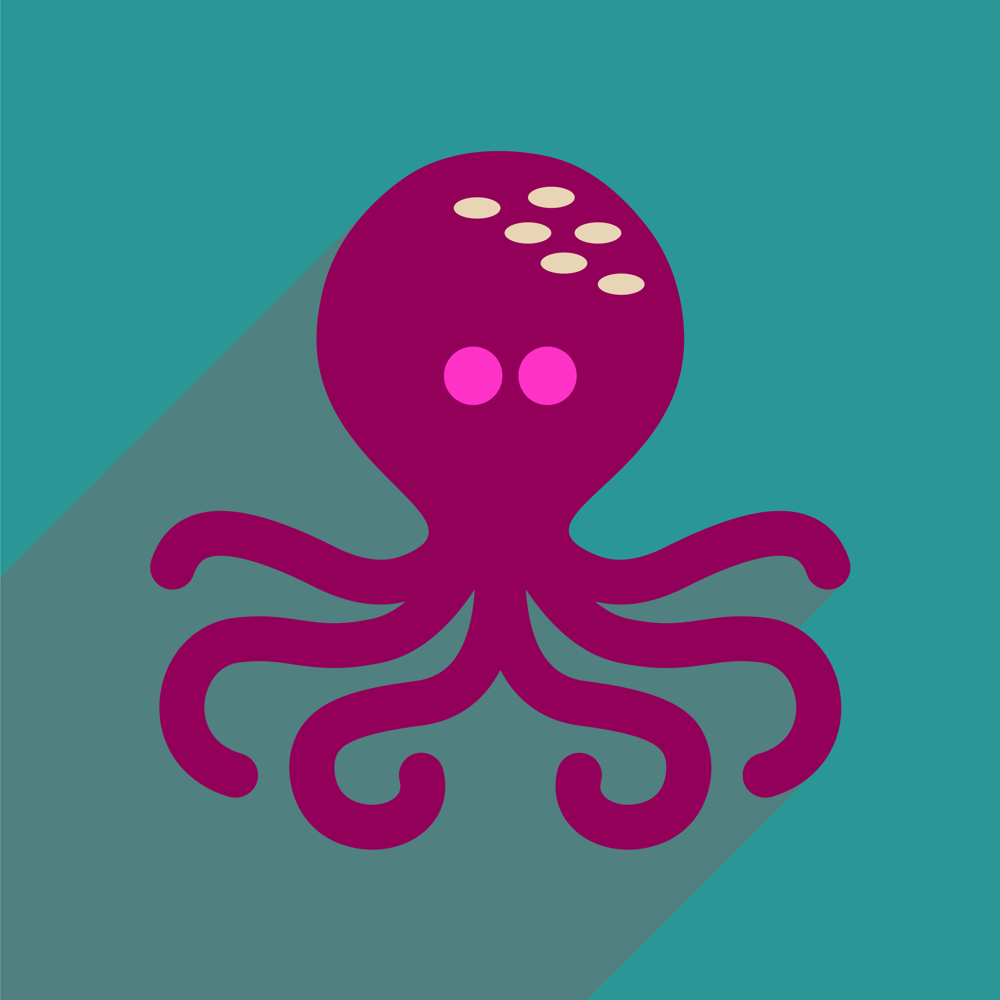

# [OctoMuyThai Website](https://oludare89.github.io/OctoMuyThai_MS1_Project/)

This website is for the OctoMuyThai gym and is a gym training students in the Thailand martial art of Muy Thai. The website is designed to work across a range of platforms from desktop to mobile to allow easy accessiblity for current and new students alike as well as those interested casually in the art of Muy Thai.

## User experience

### Strategy Plane

The goal of the website for the business owner of the gym is to encourage new students to take up and practice the martial art of Muy Thai at the OctoMuyThai gym. 

The goal for visitors at the site will be to understand the services provided by the gym, find out the price of membership and be able to sign up and become a member of the gym.

### Scope Plane

The main feature is a landing page showcasing the gym and it's branded and the benefits of joining. This will achieve the goal of presenting why it would be a good idea to become a member of the gym.

The additional features will be pages presenting Muy Thai techniques, showing the timetable for classes at the gym, presenting the price of gym membership and a sign up page so that visitors to the site can join the gym. This achieves the goal of helping site visitors understanding the services provided by the gym, the price of membership and enabling new students to sign up.

### Structure Plane

Main structure will be the landing page presenting the brand and benefits of joining as a member at OctoMuyThai.

A seperate page each for description and tutorial of Muy Thai techniques, timetable and membership pricing and finally sign up page and detailed description of where and how to find the gym.

The logic being that description of techniques serves the purpose of showcasing the martial art to students so should have a dedicated page. Then, a key part of knowing whether you want to join the gym is to know the timing of classes and the pricing of membership and one-off classes so it makes sense from an user experience perspective to group this together. Lastly, is the sign up page where site visitors can sign up for gym membership and it is assumed at this stage from the previous pages the user has determined and finalised the decision on whether to join or not and therefore would want to sign up and then also know exactly how to find the gym as a final confirmation of information in order to make the decision to join.

### Skeleton Plane

The header of the page will contain the name of the gym, tagline and logo. Within the header, there will also be a navigation bar to the different pages of the site. The main content will then follow with the appropriate information clearly and concisely presented in each page as per the structure plane. There will then be a footer which contains the address of the gym, social media links and then another navigation bar to save users having to scroll back up to the very top of the page in order to navigate to different pages of the site.

### Surface Plane

#### Colour scheme
The main colour scheme is blue and orange, specifically #37A3C8 and #C85C37. Canva's color wheel was utilisied in order to determine this colour scheme and to ensure that it was complementary.

#### Typography
The font used is Nunito from Google Fonts.

#### Imagery
The imagery is vital especially with the logo which incorporates the eight limbs philosophy of Muy Thai and matches with the colour scheme used. Background images were used in some instances with the orange background colour to complement the content.

### Wireframes
* Home Page Wireframe
* Techniques Page Wireframe
* Timetable Page Wireframe
* Sign Up Page Wireframe

### User Stories
* As a site user, I want to be able to easily navigate to other pages on the website to access specific information.
* As a site user, I want to know the name of the gym.
* As a site user, I want to know why I should join this gym.
* As a site user, I want to be able to see any Muy Thai techniques I'm interested in learning.
* As a site user, I want to know the timing of the classes at the gym.
* As a site user, I want to know the price of membership at the gym.
* As a site user, I want to be able to join the gym.
* As a site user, I want to find directions to get to the gym.

## Features
* Responsive and functional on all device sizes
* Interactive

## Technologies Used
* HTML5
* CSS3

## Frameworks, Libraries and Programs Used
1. Bootstrap 4.5.2:
* Bootstrap was used to assist with the styling and responsiveness of the website
2. Hover.css:
* Hover.css was used on the navigation bar to perform a float animation as the mouse hovers over each navigation item.
3. Google Fonts
* Google fonts was used to import the Cairo and BioRhyme fonts into the style.css file which is used through the pages in this project.
4. Font Awesome
* Font awesome was used for the social media links in the footer of the pages of the project.
5. Git
* Git was used for version control by utilising the Gitpod terminal to commit to Git and push to Github.
6. Github
* Github was used to store the project code and to host and display the project in Github Pages.
7. Balsamiq
* Balsamiq was used to create the wireframes to provide a guide for the design.

## Testing
The W3C Markup Validator and W3C CSS Validator were used to validate every page of the project to avoid any syntax errors.

* W3C Markup Validator - frameborder attribute in the iframe element deemed obselete thus subsequently removed - no other errors or warnings were flagged.
* W3C CSS Validator - 

